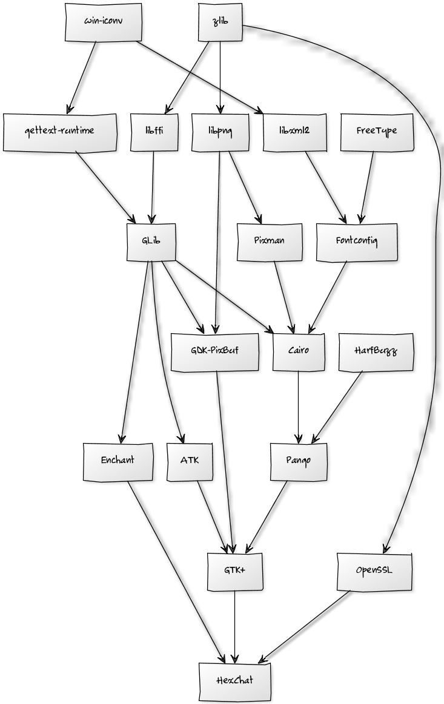

## About

This page is intended to guide you through the process of building the whole GTK+ stack (and some additional libraries required by HexChat) on Windows using Visual C++ a.k.a. MSVC, version 10 that comes with Visual Studio 2010. It is largely based on Chun-wei Fan's [Compiling the GTK+ stack using Visual C++](https://live.gnome.org/GTK%2B/Win32/MSVCCompilationOfGTKStack). Thanks!

You can also skip the building process and right off just **download** and use the Visual C++ builds of GTK+ so that you don't have to <del>waste</del>spend weeks (months?) on getting it to work like I had. So without further ado:

## GTK+ Visual C++ Builds:

<table>

<tr>
<td>Microsoft Visual C++ Redistributable Package</td>
<td>2010 SP1</td>
<td><a href="http://www.microsoft.com/en-us/download/details.aspx?id=8328">32 bit</a></td>
<td><a href="http://www.microsoft.com/en-us/download/details.aspx?id=13523">64 bit</a></td>
</tr>

<tr class="even">
<td>zlib</td>
<td>1.2.7</td>
<td><a href="http://dl.hexchat.org/gtk-win32/vc10/x86/zlib-1.2.7-x86.7z">32 bit</a></td>
<td><a href="http://dl.hexchat.org/gtk-win32/vc10/x64/zlib-1.2.7-x64.7z">64 bit</a></td>
</tr>

<tr>
<td>win-iconv</td>
<td>0.0.6</td>
<td><a href="http://dl.hexchat.org/gtk-win32/vc10/x86/win-iconv-0.0.6-x86.7z">32 bit</a></td>
<td><a href="http://dl.hexchat.org/gtk-win32/vc10/x64/win-iconv-0.0.6-x64.7z">64 bit</a></td>
</tr>

<tr class="even">
<td>FreeType</td>
<td>2.4.11</td>
<td><a href="http://dl.hexchat.org/gtk-win32/vc10/x86/freetype-2.4.11-x86.7z">32 bit</a></td>
<td><a href="http://dl.hexchat.org/gtk-win32/vc10/x64/freetype-2.4.11-x64.7z">64 bit</a></td>
</tr>

<tr>
<td>libxml2</td>
<td>2.9.0</td>
<td><a href="http://dl.hexchat.org/gtk-win32/vc10/x86/libxml2-2.9.0-x86.7z">32 bit</a></td>
<td><a href="http://dl.hexchat.org/gtk-win32/vc10/x64/libxml2-2.9.0-x64.7z">64 bit</a></td>
</tr>

<tr class="even">
<td>gettext-runtime</td>
<td>0.18</td>
<td><a href="http://dl.hexchat.org/gtk-win32/vc10/x86/gettext-runtime-0.18-x86.7z">32 bit</a></td>
<td><a href="http://dl.hexchat.org/gtk-win32/vc10/x64/gettext-runtime-0.18-x64.7z">64 bit</a></td>
</tr>

<tr>
<td>OpenSSL</td>
<td>1.0.1e</td>
<td><a href="http://dl.hexchat.org/gtk-win32/vc10/x86/openssl-1.0.1e-x86.7z">32 bit</a></td>
<td><a href="http://dl.hexchat.org/gtk-win32/vc10/x64/openssl-1.0.1e-x64.7z">64 bit</a></td>
</tr>

<tr class="even">
<td>libffi</td>
<td>3.0.11</td>
<td><a href="http://dl.hexchat.org/gtk-win32/vc10/x86/libffi-3.0.11-x86.7z">32 bit</a></td>
<td><a href="http://dl.hexchat.org/gtk-win32/vc10/x64/libffi-3.0.11-x64.7z">64 bit</a></td>
</tr>

<tr>
<td>libpng</td>
<td>1.5.14</td>
<td><a href="http://dl.hexchat.org/gtk-win32/vc10/x86/libpng-1.5.14-x86.7z">32 bit</a></td>
<td><a href="http://dl.hexchat.org/gtk-win32/vc10/x64/libpng-1.5.14-x64.7z">64 bit</a></td>
</tr>

<tr class="even">
<td>Fontconfig</td>
<td>2.8.0</td>
<td><a href="http://dl.hexchat.org/gtk-win32/vc10/x86/fontconfig-2.8.0-x86.7z">32 bit</a></td>
<td><a href="http://dl.hexchat.org/gtk-win32/vc10/x64/fontconfig-2.8.0-x64.7z">64 bit</a></td>
</tr>

<tr>
<td>Pixman</td>
<td>0.26.2</td>
<td><a href="http://dl.hexchat.org/gtk-win32/vc10/x86/pixman-0.26.2-x86.7z">32 bit</a></td>
<td><a href="http://dl.hexchat.org/gtk-win32/vc10/x64/pixman-0.26.2-x64.7z">64 bit</a></td>
</tr>

<tr class="even">
<td>GLib</td>
<td>2.34.3</td>
<td><a href="http://dl.hexchat.org/gtk-win32/vc10/x86/glib-2.34.3-x86.7z">32 bit</a></td>
<td><a href="http://dl.hexchat.org/gtk-win32/vc10/x64/glib-2.34.3-x64.7z">64 bit</a></td>
</tr>

<tr>
<td>Enchant</td>
<td>1.6.0</td>
<td><a href="http://dl.hexchat.org/gtk-win32/vc10/x86/enchant-1.6.0-x86.7z">32 bit</a></td>
<td><a href="http://dl.hexchat.org/gtk-win32/vc10/x64/enchant-1.6.0-x64.7z">64 bit</a></td>
</tr>

<tr class="even">
<td>ATK</td>
<td>2.7.5</td>
<td><a href="http://dl.hexchat.org/gtk-win32/vc10/x86/atk-2.7.5-x86.7z">32 bit</a></td>
<td><a href="http://dl.hexchat.org/gtk-win32/vc10/x64/atk-2.7.5-x64.7z">64 bit</a></td>
</tr>

<tr>
<td>GDK-PixBuf</td>
<td>2.26.5</td>
<td><a href="http://dl.hexchat.org/gtk-win32/vc10/x86/gdk-pixbuf-2.26.5-x86.7z">32 bit</a></td>
<td><a href="http://dl.hexchat.org/gtk-win32/vc10/x64/gdk-pixbuf-2.26.5-x64.7z">64 bit</a></td>
</tr>

<tr class="even">
<td>cairo</td>
<td>1.10.2</td>
<td><a href="http://dl.hexchat.org/gtk-win32/vc10/x86/cairo-1.10.2-x86.7z">32 bit</a></td>
<td><a href="http://dl.hexchat.org/gtk-win32/vc10/x64/cairo-1.10.2-x64.7z">64 bit</a></td>
</tr>

<tr>
<td>HarfBuzz *</td>
<td>0.9.4</td>
<td>32 bit</td>
<td>64 bit</td>
</tr>

<tr class="even">
<td>Pango</td>
<td>1.30.1</td>
<td><a href="http://dl.hexchat.org/gtk-win32/vc10/x86/pango-1.30.1-x86.7z">32 bit</a></td>
<td><a href="http://dl.hexchat.org/gtk-win32/vc10/x64/pango-1.30.1-x64.7z">64 bit</a></td>
</tr>

<tr>
<td>GTK+</td>
<td>2.24.15</td>
<td><a href="http://dl.hexchat.org/gtk-win32/vc10/x86/gtk-2.24.15-x86.7z">32 bit</a></td>
<td><a href="http://dl.hexchat.org/gtk-win32/vc10/x64/gtk-2.24.15-x64.7z">64 bit</a></td>
</tr>

<tr class="even">
<td><b>GTK+ bundle</b></td>
<td>2.24.15</td>
<td><a href="http://dl.hexchat.org/gtk-win32/vc10/x86/gtk-x86.7z">32 bit</a></td>
<td><a href="http://dl.hexchat.org/gtk-win32/vc10/x64/gtk-x64.7z">64 bit</a></td>
</tr>

</table>

\* HarfBuzz will be required for Pango 1.32 only, unsupported currently 

## Building from Source

If you feel brave enough to build these on your own, bear in mind, GTK+ on Windows is **pain in the ass**. You're warned.

If this graph wasn't enough to frighten you off and you still think you want to do this, you'll need to install:

 * [Visual Studio 2010 Professional Trial](http://www.microsoft.com/en-us/download/details.aspx?id=16057)
 * [CMake 2.8](http://www.cmake.org/cmake/resources/software.html)
 * [MozillaBuild](http://ftp.mozilla.org/pub/mozilla.org/mozilla/libraries/win32/)
 * Perl 5.16 [x86](http://dl.hexchat.org/misc/perl-5.16.2-x86.7z) or [x64](http://dl.hexchat.org/misc/perl-5.16.2-x64.7z) (extract to _C:\mozilla-build\perl-5.16\Win32_ or _C:\mozilla-build\perl-5.16\x64_)
 * [NASM](http://www.nasm.us/pub/nasm/releasebuilds/?C=M;O=D) (extract to _C:\mozilla-build\nasm_)
 * [msgftm](http://dl.hexchat.org/misc/msgfmt-0.18.1.7z) (extract to _c:\mozilla-build_)

As you can see, these libraries have a quite complex dependency order, so it's really recommended to build them in the order they're explained here, otherwise you'll probably encounter quite a few problems (you'll most likely encounter too many problems already, at least initially). After you built something, always extract the resulting package to _C:\mozilla-build\hexchat\build\Win32_ or _C:\mozilla-build\hexchat\build\x64_. When in Visual Studio, always select the _Release_ configurations, others most likely won't work.

### zlib
 * download [zlib 1.2.7](http://dl.hexchat.org/gtk-win32/src/zlib-1.2.7.7z)
 * extract as _C:\mozilla-build\hexchat\zlib-1.2.7_
 * copy the [HexChat fixes](https://github.com/hexchat/gtk-win32/tree/master/zlib) to this folder
 * open VS x86 or x64 command prompt
 * run _build-x86.bat_ or _build-x64.bat_

### win-iconv
 * download [win-iconv 0.0.6](http://dl.hexchat.org/gtk-win32/src/win-iconv-0.0.6.7z)
 * extract as _C:\mozilla-build\hexchat\win-iconv-0.0.6_
 * copy the [HexChat fixes](https://github.com/hexchat/gtk-win32/tree/master/win-iconv) to this folder
 * open VS x86 or x64 command prompt
 * run _build-x86.bat_ or _build-x64.bat_

### FreeType
 * download [FreeType 2.4.11](http://dl.hexchat.org/gtk-win32/src/freetype-2.4.11.7z)
 * extract as _C:\mozilla-build\hexchat\freetype-2.4.11_
 * copy the [HexChat fixes](https://github.com/hexchat/gtk-win32/tree/master/freetype) to this folder
 * open _builds\win32\vc11\freetype.sln_ and compile for Win32 or x64
 * run _release-x86.bat_ or _release-x64.bat_

### libxml2
 * download [libxml2 2.9.0](http://dl.hexchat.org/gtk-win32/src/libxml2-2.9.0.7z)
 * extract as _C:\mozilla-build\hexchat\libxml2-2.9.0_
 * copy the [HexChat fixes](https://github.com/hexchat/gtk-win32/tree/master/libxml2) to this folder
 * open _win32\vc11\libxml2.sln_ and compile for Win32 or x64
 * run _release-x86.bat_ or _release-x64.bat_

### gettext-runtime
 * download [gettext-runtime 0.18](http://dl.hexchat.org/gtk-win32/src/gettext-runtime-0.18.7z)
 * extract as _C:\mozilla-build\hexchat\gettext-runtime-0.18_
 * copy the [HexChat fixes](https://github.com/hexchat/gtk-win32/tree/master/gettext-runtime) to this folder
 * convert _gettext-runtime\intl\intl.def_ to Unix EOL
 * open VS x86 or x64 command prompt
 * apply the patch with `patch -p1 -i gettext-runtime.patch`
 * run _build-x86.bat_ or _build-x64.bat_

### OpenSSL
 * download [OpenSSL 1.0.1e](http://dl.hexchat.org/gtk-win32/src/openssl-1.0.1e.7z)
 * extract as _C:\mozilla-build\hexchat\openssl-1.0.1e_
 * copy the [HexChat fixes](https://github.com/hexchat/gtk-win32/tree/master/openssl) to this folder
 * open VS x86 or x64 command prompt
 * run _build-x86.bat_ or _build-x64.bat_

### libffi
 * download [libffi 3.0.11](http://dl.hexchat.org/gtk-win32/src/libffi-3.0.11.7z)
 * extract as _C:\mozilla-build\hexchat\libffi-3.0.11_
 * copy the [HexChat fixes](https://github.com/hexchat/gtk-win32/tree/master/libffi) to this folder
 * start a shell with _start-msvc10.bat_ or _start-msvc10-x64.bat_ from MozillaBuild
 * in this shell, run _build-x86.bat_ or _build-x64.bat_
 * in a regular command prompt, run _release-x86.bat_ or _release-x64.bat_

### libpng
 * download [libpng 1.5.14](http://dl.hexchat.org/gtk-win32/src/libpng-1.5.14.7z)
 * extract as _C:\mozilla-build\hexchat\libpng-1.5.14_
 * copy the [HexChat fixes](https://github.com/hexchat/gtk-win32/tree/master/libpng) to this folder
 * open _projects\vstudio\vstudio.sln_ and compile for Win32 or x64
 * run _release-x86.bat_ or _release-x64.bat_

### Fontconfig
 * download [Fontconfig 2.8.0](http://dl.hexchat.org/gtk-win32/src/fontconfig-2.8.0.7z)
 * extract as _C:\mozilla-build\hexchat\fontconfig-2.8.0_
 * copy the [HexChat fixes](https://github.com/hexchat/gtk-win32/tree/master/fontconfig) to this folder
 * apply the patch with `patch -p1 -i fontconfig.patch`
 * open _fontconfig.sln_, set _build_ as startup project and compile for Win32 or x64 (you might have to press F7 a few times)
 * run _release-x86.bat_ or _release-x64.bat_

### Pixman
 * download [Pixman 0.26.2](http://dl.hexchat.org/gtk-win32/src/pixman-0.26.2.7z)
 * extract as _C:\mozilla-build\hexchat\pixman-0.26.2_
 * copy the [HexChat fixes](https://github.com/hexchat/gtk-win32/tree/master/pixman) to this folder
 * apply the patch with `patch -p1 -i pixman.patch`
 * open _build\win32\vc11\pixman.sln_, set _install_ as startup project and compile for Win32 or x64
 * run _release-x86.bat_ or _release-x64.bat_

### GLib
 * download [GLib 2.34.3](http://dl.hexchat.org/gtk-win32/src/glib-2.34.3.7z)
 * extract as _C:\mozilla-build\hexchat\glib-2.34.3_
 * copy the [HexChat fixes](https://github.com/hexchat/gtk-win32/tree/master/glib) to this folder
 * open _build\win32\vc11\glib.sln_, set _install_ as startup project and compile for Win32 or x64
 * run _release-x86.bat_ or _release-x64.bat_

### Enchant
 * download [Enchant 1.6.0](http://dl.hexchat.org/gtk-win32/src/enchant-1.6.0.7z)
 * extract as _C:\mozilla-build\hexchat\enchant-1.6.0_
 * copy the [HexChat fixes](https://github.com/hexchat/gtk-win32/tree/master/enchant) to this folder
 * open VS x86 or x64 command prompt
 * run _build-x86.bat_ or _build-x64.bat_

### ATK
 * download [ATK 2.7.5](http://dl.hexchat.org/gtk-win32/src/atk-2.7.5.7z)
 * extract as _C:\mozilla-build\hexchat\atk-2.7.5_
 * copy the [HexChat fixes](https://github.com/hexchat/gtk-win32/tree/master/atk) to this folder
 * open _build\win32\vc11\atk.sln_, set _install_ as startup project and compile for Win32 or x64
 * run _release-x86.bat_ or _release-x64.bat_

### GDK-PixBuf
 * download [GDK-PixBuf 2.26.5](http://dl.hexchat.org/gtk-win32/src/gdk-pixbuf-2.26.5.7z)
 * extract as _C:\mozilla-build\hexchat\gdk-pixbuf-2.26.5_
 * copy the [HexChat fixes](https://github.com/hexchat/gtk-win32/tree/master/gdk-pixbuf) to this folder
 * open _build\win32\vc11\gdk-pixbuf.sln_, set _install_ as startup project and compile for Win32 or x64
 * run _release-x86.bat_ or _release-x64.bat_

### cairo
 * download [cairo 1.10.2](http://dl.hexchat.org/gtk-win32/src/cairo-1.10.2.7z)
 * extract as _C:\mozilla-build\hexchat\cairo-1.10.2_
 * copy the [HexChat fixes](https://github.com/hexchat/gtk-win32/tree/master/cairo) to this folder
 * apply the patch with `patch -p1 -i cairo.patch`
 * open _cairo.sln_ and compile for Win32 or x64
 * run _release-x86.bat_ or _release-x64.bat_

### Pango
 * download [Pango 1.30.1](http://dl.hexchat.org/gtk-win32/src/pango-1.30.1.7z)
 * extract as _C:\mozilla-build\hexchat\pango-1.30.1_
 * copy the [HexChat fixes](https://github.com/hexchat/gtk-win32/tree/master/pango) to this folder
 * open _build\win32\vc11\pango.sln_, set install as startup project and compile for Win32 or x64
 * run _release-x86.bat_ or _release-x64.bat_

### GTK+
 * download [GTK+ 2.24.15](http://dl.hexchat.org/gtk-win32/src/gtk-2.24.15.7z)
 * extract as _C:\mozilla-build\hexchat\gtk-2.24.15_
 * copy the [HexChat fixes](https://github.com/hexchat/gtk-win32/tree/master/gtk) to this folder
 * apply the patch with `patch -p1 -i gtk-pixmap.patch`
 * open _build\win32\vc11\gtk+.sln_, set install as startup project and compile for Win32 or x64
 * run _release-x86.bat_ or _release-x64.bat_
