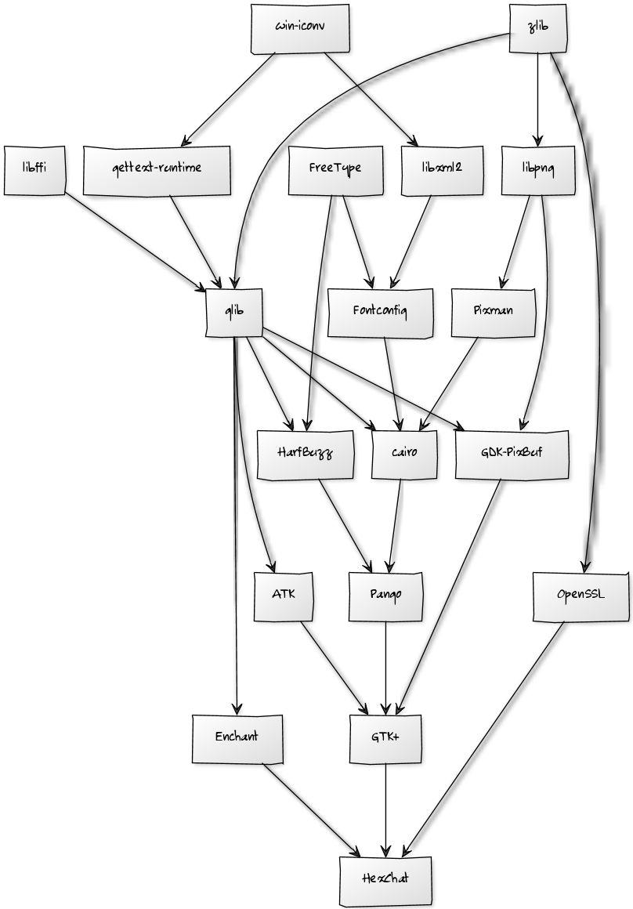

## About

This page is intended to guide you through the process of building the whole GTK+ stack (and a few additional libraries required by HexChat) on Windows using Visual C++ a.k.a. MSVC, version 12 that comes with Visual Studio 2013. It is largely based on Chun-wei Fan's [Compiling the GTK+ stack using Visual C++](https://live.gnome.org/GTK%2B/Win32/MSVCCompilationOfGTKStack). Thanks!

You can also skip the building process and right off just **download** and use the Visual C++ builds of GTK+ so that you don't have to spend **a lot** of time on getting it to work like we had. So without further ado:

## GTK+ Visual C++ Builds:

This is the redistributable and a bundle of all the GTK+ stuff. **This is most likely what you need**.

<table>
    <tr>
        <td>Microsoft Visual C++ Redistributable Package</td>
        <td>2013</td>
        <td><a href="http://www.microsoft.com/en-us/download/details.aspx?id=40007">32 bit</a></td>
        <td><a href="http://www.microsoft.com/en-us/download/details.aspx?id=40007">64 bit</a></td>
    </tr>
    <tr>
        <td>GTK+ bundle</td>
        <td>2.24.23</td>
        <td><a href="http://dl.hexchat.net/gtk-win32/vc12/x86/gtk-x86.7z">32 bit</a></td>
        <td><a href="http://dl.hexchat.net/gtk-win32/vc12/x64/gtk-x64.7z">64 bit</a></td>
    </tr>
</table>

These are the separate packages for advanced users. These also require the redistributable to be installed.

<table>
    <tr>
        <td>ATK</td>
        <td>2.12.0</td>
        <td><a href="http://dl.hexchat.net/gtk-win32/src/atk-2.12.0.7z">Source</a></td>
    </tr>
    <tr>
        <td>cairo</td>
        <td>1.12.16</td>
        <td><a href="http://dl.hexchat.net/gtk-win32/src/cairo-1.12.16.7z">Source</a></td>
    </tr>
    <tr>
        <td>Enchant</td>
        <td>1.6.0</td>
        <td><a href="http://dl.hexchat.net/gtk-win32/src/enchant-1.6.0.7z">Source</a></td>
    </tr>
    <tr>
        <td>Fontconfig</td>
        <td>2.8.0</td>
        <td><a href="http://dl.hexchat.net/gtk-win32/src/fontconfig-2.8.0.7z">Source</a></td>
    </tr>
    <tr>
        <td>FreeType</td>
        <td>2.5.3</td>
        <td><a href="http://dl.hexchat.net/gtk-win32/src/freetype-2.5.3.7z">Source</a></td>
    </tr>
    <tr>
        <td>GDK-PixBuf</td>
        <td>2.30.7</td>
        <td><a href="http://dl.hexchat.net/gtk-win32/src/gdk-pixbuf-2.30.7.7z">Source</a></td>
    </tr>
    <tr>
        <td>gettext-runtime</td>
        <td>0.18</td>
        <td><a href="http://dl.hexchat.net/gtk-win32/src/gettext-runtime-0.18.7z">Source</a></td>
    </tr>
    <tr>
        <td>GLib</td>
        <td>2.40.0</td>
        <td><a href="http://dl.hexchat.net/gtk-win32/src/glib-2.40.0.7z">Source</a></td>
    </tr>
    <tr>
        <td>GTK+</td>
        <td>2.24.24</td>
        <td><a href="http://dl.hexchat.net/gtk-win32/src/gtk-2.24.24.7z">Source</a></td>
    </tr>
    <tr>
        <td>HarfBuzz</td>
        <td>0.9.30</td>
        <td><a href="http://dl.hexchat.net/gtk-win32/src/harfbuzz-0.9.30.7z">Source</a></td>
    </tr>
    <tr>
        <td>libffi</td>
        <td>3.0.13</td>
        <td><a href="http://dl.hexchat.net/gtk-win32/src/libffi-3.0.13.7z">Source</a></td>
    </tr>
    <tr>
        <td>libpng</td>
        <td>1.6.12</td>
        <td><a href="http://dl.hexchat.net/gtk-win32/src/libpng-1.6.12.7z">Source</a></td>
    </tr>
    <tr>
        <td>libxml2</td>
        <td>2.9.1</td>
        <td><a href="http://dl.hexchat.net/gtk-win32/src/libxml2-2.9.1.7z">Source</a></td>
    </tr>
    <tr>
        <td>OpenSSL</td>
        <td>1.0.1h</td>
        <td><a href="http://dl.hexchat.net/gtk-win32/src/openssl-1.0.1h.7z">Source</a></td>
    </tr>
    <tr>
        <td>Pango</td>
        <td>1.36.5</td>
        <td><a href="http://dl.hexchat.net/gtk-win32/src/pango-1.36.5.7z">Source</a></td>
    </tr>
    <tr>
        <td>Pixman</td>
        <td>0.32.6</td>
        <td><a href="http://dl.hexchat.net/gtk-win32/src/pixman-0.32.6.7z">Source</a></td>
    </tr>
    <tr>
        <td>win-iconv</td>
        <td>0.0.6</td>
        <td><a href="http://dl.hexchat.net/gtk-win32/src/win-iconv-0.0.6.7z">Source</a></td>
    </tr>
    <tr>
        <td>zlib</td>
        <td>1.2.8</td>
        <td><a href="http://dl.hexchat.net/gtk-win32/src/zlib-1.2.8.7z">Source</a></td>
    </tr>
</table>

## Building from Source

Building GTK+ and its dependencies on Windows has never been easier. We have a PowerShell script which does most of the work for you, so you just have to wait until it finishes. But first of all, here's the dependency graph of the GTK+ stack.

To compile all this yourself, you need to install:

 * [Visual Studio 2013 Express for Windows Desktop](http://www.microsoft.com/visualstudio/eng/2013-downloads#d-2013-express)
 * [CMake 2.8](http://www.cmake.org/cmake/resources/software.html)
 * [MozillaBuild 1.9](http://ftp.mozilla.org/pub/mozilla.org/mozilla/libraries/win32/)
 * Perl 5.20 [x86](http://dl.hexchat.net/misc/perl/perl-5.20.0-x86.7z) or [x64](http://dl.hexchat.net/misc/perl/perl-5.20.0-x64.7z) (extract to _C:\mozilla-build\perl-5.20\Win32_ or _C:\mozilla-build\perl-5.20\x64_)
 * [NASM](http://www.nasm.us/pub/nasm/releasebuilds/?C=M;O=D) (extract to _C:\mozilla-build\nasm_)
 * [msgfmt](http://dl.hexchat.net/gtk-win32/msgfmt-0.18.1.7z) (extract to _c:\mozilla-build_)
 * [Ragel](http://dl.hexchat.net/gtk-win32/ragel-6.8.7z) (extract to _c:\mozilla-build_)
 * [7-Zip](http://www.7-zip.org/download.html) (install to _C:\Program Files\7-Zip_; do not use the _7z.exe_ bundled with MozillaBuild)

When you're done installing these, you also have to clone the [GTK-Win32](https://github.com/hexchat/gtk-win32) repo to _c:\mozilla-build\hexchat\github\gtk-win32_.

You can use other paths, but then make sure to feed _gtk-win32\build.ps1_ with the correct parameters (open the script with an editor for examples).

Now you have to allow PowerShell scripts to be run on your system. Open a PowerShell prompt *as Administrator* and run the following command:

<pre>Set-ExecutionPolicy RemoteSigned</pre>

Once done, close this elevated shell, and run PowerShell as a regular user. Go to the _gtk-win32_ repo root and start building with the script.
The example below will perform a default build for x86:

<pre>cd c:\mozilla-build\hexchat\github\gtk-win32
.\build.ps1 -Configuration x86</pre>

Once ready, your GTK+ stack will be found under _c:\mozilla-build\hexchat\gtk_. Enjoy!
